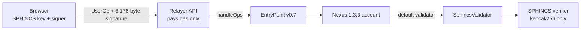

# PQ Nexus

An Ethereum smart account with no ECDSA key. A [Nexus 1.3.3](https://github.com/bcnmy/stx-contracts/tree/887924afbcf57a07e68691dfb19fe38b527d7c4c) account whose only validator checks SPHINCS, a hash-based signature scheme. Moving funds needs a valid SPHINCS signature, and forging one means breaking keccak256. It runs on Ethereum today through ERC-4337 and ERC-7579, with no protocol change.

Live demo on Sepolia: generate a key in the browser, deploy an account, mint and send funds, and try to break it with an ECDSA signature. All contracts are verified on Etherscan.

## Disclaimer

**This repository is for demonstration and research purposes only.**

- The SPHINCS verifier is experimental, unaudited research code. It implements the sphincs-g parameter set, which is not standardized SLH-DSA (FIPS 205).
- The `SphincsValidator` module and the browser signer are unaudited and were written for this demo.
- Only the Nexus account code (unchanged audited bytecode) has been audited. Audits of Nexus do not cover anything else in this repository.
- Nothing here is claimed to be secure against quantum or classical attacks. Bugs may lead to permanent loss of funds.
- Use it on testnets only. Do not deploy it to mainnet, and do not send real assets to any address it creates.
- The demo stores keys in browser storage without protection.

Provided as is, without warranty of any kind. You use it at your own risk.

## How it works



| Piece | What it is | Status |
|---|---|---|
| `Nexus`, `NexusBootstrap`, `NexusAccountFactory` | Deployed from the canonical MEE suite 2.2.3 artifacts at `stx-contracts@887924af`, the exact creation bytecode behind Nexus 1.3.3. Only the constructor arguments differ: the default validator is `SphincsValidator` (the canonical deployment uses `K1MeeValidator`). | Audited (Zenith, Cantina, Cyfrin CodeHawks, Pashov) |
| `SphincsVerifier` | `SphincsVerifier_v2` from [RivaLabs-Core/Post-Quantum-AA-Infra@67b04de](https://github.com/RivaLabs-Core/Post-Quantum-AA-Infra/blob/67b04de3e9562f48759826c279c70a8087b4f8ae/src/Verifiers/SphincsVerifier_v2.sol), MIT. sphincs-g parameters (n=16 h=20 d=5 a=9 k=19 w=16), keccak256, 6,176-byte signatures. An experimental SPHINCS+ variant that differs from the standardized SLH-DSA. Only the pragma was relaxed to 0.8.27. | Unaudited research code |
| `SphincsValidator` | ERC-7579 validator, about 130 lines. Stores `(pkSeed, pkRoot)` per account, verifies the userOpHash, binds ERC-1271 signatures to chain and account, supports key rotation. | Unaudited |
| `PqDemoToken` | Free-mint `pqUSD` so demo accounts have something to move. | Demo only |
| `app/lib/sphincs.mjs` | Browser signer, a port of the RivaLabs Python reference. Reproduces the reference vector byte for byte. | Demo only |

Because `SphincsValidator` is the account's **default** validator, there is no ECDSA validator on these accounts at all. Nonce key 0 selects it. The account address is CREATE2 over the init data, so it commits to the SPHINCS public key.

### Measured gas (live Sepolia, Glamsterdam)

Simulated with `eth_simulateV1` against live Sepolia state on 2026-10-08 (`app/scripts/measure-gas.mts`, two runs). Transaction gas, including the 6,176-byte signature calldata:

| Operation | Tx gas |
|---|---|
| Deploy account + mint | ~1.36M to 1.56M |
| Send pqUSD to a new holder | ~650k to 665k |
| Send ETH to a new address | ~730k to 750k |
| Send ETH to an existing address | ~550k to 560k |
| `verify()` alone | ~355k execution |

Glamsterdam (EIP-8037) prices new state at 1,530 gas per byte, which is why account creation and transfers to new holders cost more than before the upgrade.

### What this does not cover

- **Consensus.** Ethereum validators sign with BLS (elliptic curve). The chain itself still needs the hash-based consensus roadmap.
- **Issuers.** A token is only as safe as its admin keys.
- **The hash.** Security reduces to keccak256 being hard to invert. That is an assumption, and it cannot be proven.
- **The relayer.** It pays gas with an ordinary ECDSA key. Breaking that key would expose the relayer's gas budget. Account funds stay behind the SPHINCS key.

## Repository

```
contracts/   Foundry: verifier, validator, demo token, deploy scripts, tests
  lib/stx-contracts   submodule pinned at 887924af (Nexus 1.3.3, MEE suite 2.2.3)
app/         Next.js app: UI, /api/relay (sponsored bundler), /api/rpc (read-only proxy)
```

## Run locally

```bash
./scripts/local.sh
```

Forks Sepolia with anvil, deploys the suite at the same addresses, funds a throwaway relayer (written to `app/.env.local`) and starts the app on http://localhost:3000. To give your demo account ETH on the fork: `./scripts/local.sh fund <address>`. Ctrl+C stops everything. Requires Foundry and pnpm.

## Contracts

```bash
git submodule update --init --recursive
(cd contracts/lib/stx-contracts && pnpm install --frozen-lockfile --ignore-scripts)
cd contracts
forge test -vv            # forks Sepolia; SEPOLIA_RPC_URL optional
```

Tests sign through `app/lib/sphincs.mjs` via FFI, so the contracts and the browser use the same signer.

### Deploy (Sepolia)

Addresses are deterministic: CREATE2 through `0x4e59b44847b379578588920cA78FbF26c0B4956C`, with per-contract salts mined by `script/Mine.s.sol` so every address starts with `0x5afe`. The factory's creation code includes its staking owner, so its salt is only valid for `FACTORY_OWNER` (`0x531b827c1221EC7CE13266e8F5CB1ec6Ae470be5`); the deploy script refuses any other deployer. To deploy from another address, change `FACTORY_OWNER` and re-run `forge script script/Mine.s.sol`.

```bash
cd contracts
forge script script/Deploy.s.sol --rpc-url <sepolia-rpc> --broadcast --slow --skip-simulation --account <keystore>
```

`--skip-simulation` matters on Sepolia: Foundry's local simulation predates Glamsterdam and under-estimates contract creation (code deposit is now 1,530 gas per byte), so gas has to come from the node's own estimate. Deploying Nexus alone takes about 36M gas.

The script writes `deployments/11155111.json`. Copy it to `app/lib/deployment.json`.

Verify with `forge verify-contract <address> <path>:<Contract> --chain sepolia --constructor-args <args>`. The Nexus contracts compile from the pinned sources (`script/NexusSources.sol`) to exactly the canonical artifacts, so Etherscan also matches them automatically.

| Contract | Sepolia, deployed 2026-10-08 by `0x531b827c1221EC7CE13266e8F5CB1ec6Ae470be5`, verified on Etherscan |
|---|---|
| SphincsVerifier | `0x5afEC0756e47697C6Eae592debf44C4E67B0fD0A` |
| SphincsValidator | `0x5afEDD39DB9975a71c6CA68A26ca8aB38B03313C` |
| Nexus implementation | `0x5aFe78392E1783694B3143Be240a39c9C4Fe04F4` |
| NexusBootstrap | `0x5afeac4b69a31916c47947A6097A6fA13105fE2E` |
| NexusAccountFactory | `0x5Afeb10EC544fB8b057EB701f4DB1B7614b3cf3D` |
| PqDemoToken | `0x5AfE212fE1F99A518421E08Fa6A49a0A262e1ED2` |

## App

```bash
cd app
pnpm install
cp .env.example .env.local   # RELAYER_PRIVATE_KEY, optional SEPOLIA_RPC_URL
pnpm dev
```

Vercel: set the project root directory to `app` and add `RELAYER_PRIVATE_KEY` (a fresh EOA funded with Sepolia ETH) and optionally `SEPOLIA_RPC_URL`.

The relayer only accepts ops for accounts of this deployment, with zero gas fees, no paymaster and capped gas limits. It simulates every op first. Rate limits are per serverless instance, which is enough for a testnet demo.

End-to-end check against a running app (for example on an anvil fork with the suite deployed):

```bash
BASE_URL=http://localhost:3000 pnpm dlx tsx scripts/e2e.mts
```
